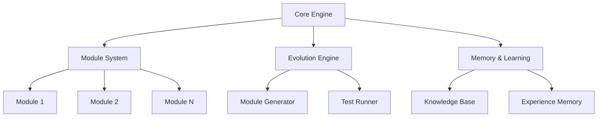
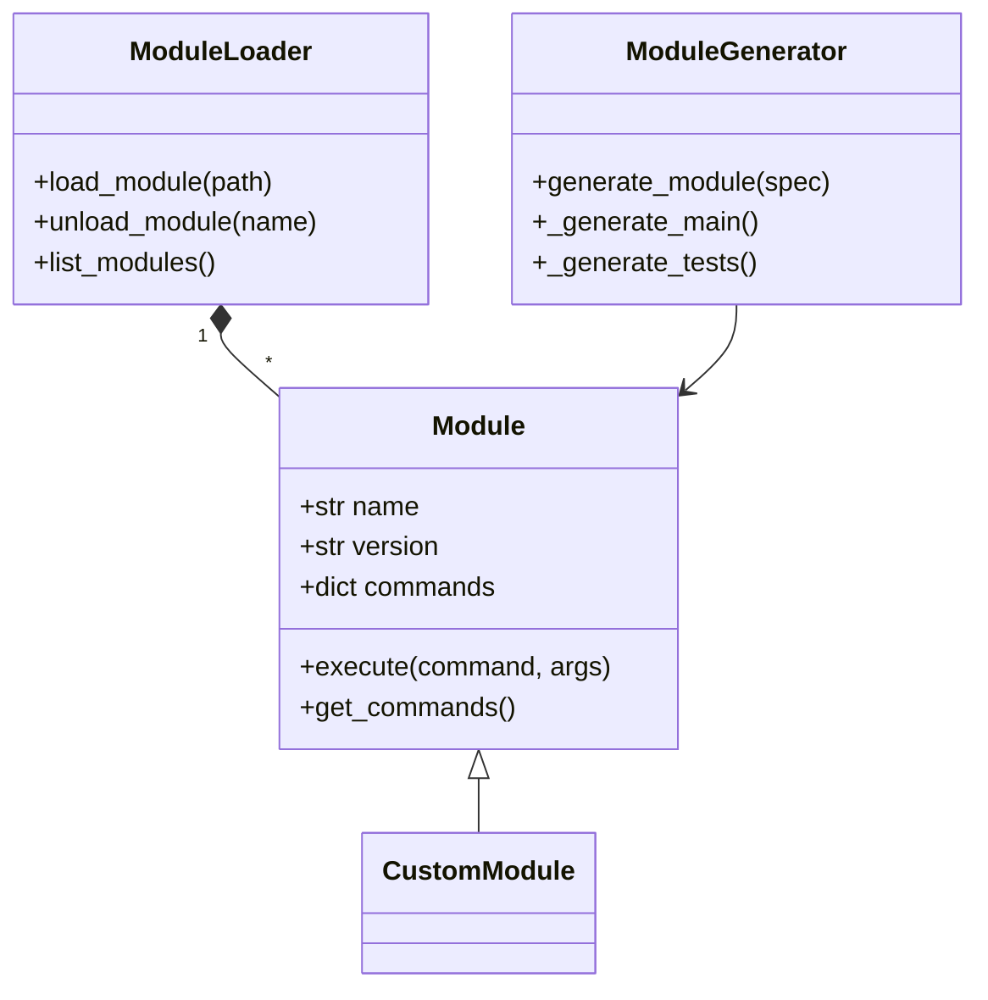
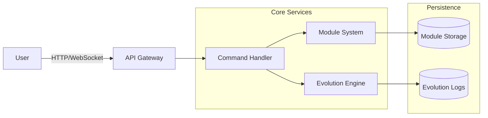
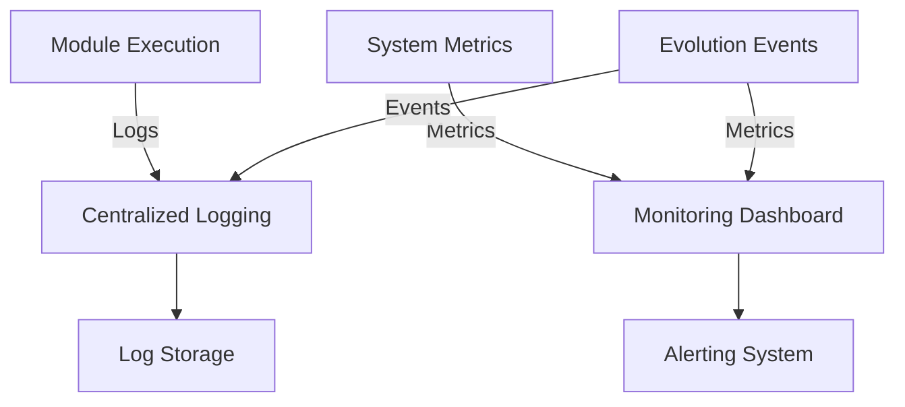
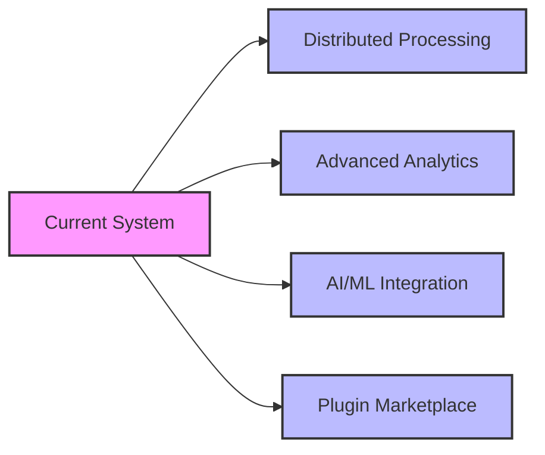

# ELLMa Architecture

## System Overview

```
+-------------------------------------------------------+
|                   ELLMa System                        |
|                                                       |
|  +----------------+          +------------------+    |
|  |   Core Engine  |<-------->|  Module System   |    |
|  +-------+--------+          +---------+--------+    |
|          ^                                |           |
|          |                                v           |
|  +-------+--------+          +---------+--------+    |
|  |  Evolution     |          |  Command         |    |
|  |  Engine        |          |  Handler         |    |
|  +-------+--------+          +---------+--------+    |
|          ^                                |           |
|          |                                v           |
|  +-------+--------+          +---------+--------+    |
|  |  Memory &      |          |  Web Interface   |    |
|  |  Learning      |          |  (Optional)      |    |
|  +----------------+          +------------------+    |
+-------------------------------------------------------+
```

## Component Architecture

### Core Components



## Data Flow

```
+-------------+      +-------------+      +-------------+
|             |      |             |      |             |
|   Input     |----->|  Processing |----->|   Output    |
|  (Command)  |      |    Flow     |      | (Response)  |
|             |      |             |      |             |
+-------------+      +------+------+      +-------------+
                           ^
                           |
                  +--------+--------+
                  |                 |
            +-----v-----+   +------v-----+
            |  Module   |   | Evolution |
            |  System   |   |  Engine   |
            +-----------+   +-----------+
```

## Module System Architecture



## Evolution Engine

```
+---------------------+     +---------------------+     +---------------------+
|                     |     |                     |     |                     |
|   Analyze Current   |---->|   Generate New      |---->|   Test & Validate   |
|     System State    |     |   Module Version    |     |   New Version      |
|                     |     |                     |     |                     |
+---------------------+     +---------------------+     +----------+----------+
                                                                  |
                                                                  v
+---------------------+     +---------------------+     +----------+----------+
|                     |     |                     |     |                     |
|  Rollback Failed    |<----|  Deploy Successful  |<----|  Integration Test   |
|     Changes         |     |     Version        |     |    New Version     |
|                     |     |                     |     |                     |
+---------------------+     +---------------------+     +---------------------+
```

## Deployment Architecture



## Security Model

```
+---------------------+     +---------------------+     +---------------------+
|                     |     |                     |     |                     |
|  Authentication &   |---->|   Module            |---->|   Resource          |
|  Authorization      |     |   Sandboxing       |     |   Access Control    |
|                     |     |                     |     |                     |
+---------------------+     +---------------------+     +---------------------+
```

## Monitoring & Logging



## Scalability Considerations

```
+---------------------+     +---------------------+     +---------------------+
|                     |     |                     |     |                     |
|  Load Balancer      |---->|  Worker Nodes       |<----|  Shared Storage     |
|  (HA)               |     |  (Stateless)        |     |  (State)            |
+----------+----------+     +----------+----------+     +----------+----------+
           |                              |                           |
           v                              v                           v
+----------+----------+     +----------+----------+     +---------------------+
|                     |     |                     |     |                     |
|  API Gateway        |     |  Module Execution   |     |  Database Cluster   |
|  (Stateless)        |     |  (Stateless)        |     |  (Stateful)         |
|                     |     |                     |     |                     |
+---------------------+     +---------------------+     +---------------------+
```

## Future Extensions



## Conclusion

This architecture provides a flexible and extensible foundation for the ELLMa system, allowing for:
- Modular design with clear separation of concerns
- Evolutionary capabilities through the evolution engine
- Scalable and maintainable codebase
- Secure execution environment
- Comprehensive monitoring and logging
- Future extensibility
